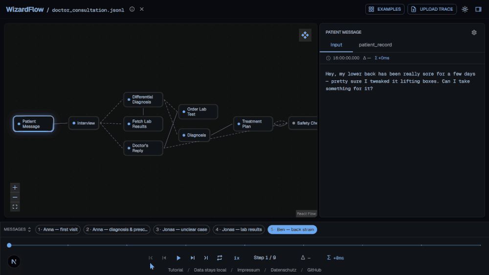

# WizardFlow Python SDK

Record agent flows from your Python code and write them to the **AgentTrace**
file format (schema `0.1`) that the WizardFlow visualizer replays.

Website: **[getwizardflow.com](https://getwizardflow.com)**



The JSON this SDK produces matches `src/types/agenttrace.ts` in the main repo
(`graph { nodes, edges }` + `messages[] → steps[] → payloads[] { label, value }`).

## Install

```bash
pip install wizardflow
```

No runtime dependencies. To work against a local checkout instead:

```bash
cd sdk/python
pip install -e ".[dev]"
```

## Quickstart

```python
import wizardflow

wizardflow.init(
    path="run.json",                    # where the trace is written
    description="A small router-based agent run.",
    nodes=["user_input", "router", "planner", "tool_node", "final_response"],
    edges=[("user_input", "router"), ("router", "planner")],
)

with wizardflow.message(id="msg-1"):
    wizardflow.log("router", "llm_input", prompt)    # same node, two payloads ->
    wizardflow.log("router", "llm_output", output)   #   folded into one step
    wizardflow.log("tool_node")                       # visited, no payloads
# message ends here -> run.json written automatically
```

There is **no `save()`**. The trace is dumped to `path` every time a message
ends — fit for a chatbot that logs continuously with no natural "end".
`init()` returns a client and also stashes it as the module default, so the
bare `wizardflow.log(...)` form above works.

## Targeting a message

A `log` call has to know which message it belongs to (messages can overlap):

```python
# ambient: inside a with-block, the id is implicit (scoped per thread/task)
with wizardflow.message(id="msg-1"):
    wizardflow.log("classifier", "input", text)

# explicit: name the message, works anywhere (no with-block needed)
wizardflow.log("classifier", "input", text, id="msg-1")
wizardflow.end_message("msg-1")          # dump signal for the explicit form
```

Pass the **string `id`**, never a handle object — safe to hand to a callback.

## LangGraph: automatic topology

Instead of listing `nodes`/`edges` by hand, read them straight from a compiled
LangGraph app:

```python
app = workflow.compile(checkpointer=memory)

wizardflow.init_from_langgraph(app, path="trace.json")

with wizardflow.message(id="msg-1"):
    wizardflow.log("planner", "Input", state)     # runtime logging unchanged
```

You can keep the extracted LangGraph topology and still choose node accent
colors for important nodes:

```python
wizardflow.init_from_langgraph(
    app,
    path="trace.json",
    node_colors={
        "router": "#A78BFA",
        "retriever": "#22D3EE",
        "generator": "#60A5FA",
    },
)
```

By default, a color key that does not match an extracted node id raises a
`WizardFlowError` so typos fail fast. With `silent=True`, unknown color keys are
ignored.

It extracts node ids (keeping `__start__` / `__end__`) and directed edges, and
marks runtime branches with `"conditional": true` (deterministic and parallel
fan-out edges stay plain):

```json
{
  "edges": [
    { "source": "__start__", "target": "router" },
    { "source": "router", "target": "planner", "conditional": true },
    { "source": "planner", "target": "final_response" }
  ]
}
```

LangGraph is **not** a dependency — extraction is duck-typed on `app.get_graph()`.
A non-LangGraph object raises `LangGraphExtractionError`; missing conditional
metadata never fails extraction (the edge is just emitted plain). Call it
**after `compile()`**, when the topology actually exists.

## API (v0.1)

- `init(path=, name=, description=, nodes=, edges=, meta=, silent=False, max_bytes=5_000_000) -> Client`
  - `description` lands in `meta.description` (matches the schema field).
  - `nodes=` enables fast-fail: `log()` to an undeclared node raises
    `UnknownNodeError` immediately (unless silenced).
  - `path` is optional; omitted, parts are written as `wizardflow_*.json` in cwd.
  - `max_bytes` caps each part file before rotation (see below).
- `init_from_langgraph(app, path=, name=, description=, meta=, node_colors=, silent=False, max_bytes=...) -> Client`
  - same as `init`, but `nodes`/`edges` come from `app.get_graph()`.
  - `node_colors` maps extracted node ids to CSS colors such as `"#A78BFA"`.
- `message(id, label=None, silent=None)` — context manager; on exit it ends the
  message and dumps. `silent` overrides the client default for this scope.
- `log(node, label=None, content=None, id=None)` — first positional is the node.
  `id=` overrides the ambient message; omitted uses the current `with` message;
  neither raises. Bare `log("node")` records a visit with no payloads.
- `end_message(id)` — mark a message complete and dump; returns the part path.
  Idempotent.
- `Client.current_path` — the part file currently being written (timestamped).
- `to_dict()` / `to_json()` — inspect the active part (completed messages).

### How saving works

`end_message` (and a `with` block's exit) triggers an **atomic write**: write to
`<part>.tmp`, then `os.replace` over the part file. The file is always a
complete, loadable `AgentTraceFile`. Only **completed** messages are written; an
in-progress message lives in memory until it ends.

### Rotation (no single huge file)

There's no natural "end" to a chatbot trace, so the SDK caps file size instead.
Each run writes **numbered part files** whose name carries the run-start time:

```
wizardflow_2026-06-08T16-29-09_001.json
wizardflow_2026-06-08T16-29-09_002.json
```

The name's `wizardflow` is the stem of the `path` you passed. When the active
part would exceed `max_bytes` (~5 MB by default), it's sealed and the next
message starts a fresh part — rotation only ever happens at a **message
boundary**, never mid-message (a lone message larger than the cap gets its own
oversized part). Each part is a **self-contained, valid trace** (full graph +
its slice of messages), chained via `meta`:

```json
"meta": { "part": 2, "prevPart": "..._001.json", "nextPart": "..._003.json" }
```

A single-part trace stays clean (no `part` metadata). There's no `partCount` —
the total is genuinely unknown while a continuous run is still logging; follow
`nextPart` to walk to the end. Since names are timestamped, read the real file
back from `wiz.current_path`, not the literal `path` you passed.

### Logging

Rotation emits an `INFO` notice on the `wizardflow` logger. Following library
convention, the SDK attaches a `NullHandler` and configures nothing — you see
nothing unless you opt in:

```python
import logging
logging.getLogger("wizardflow").setLevel(logging.INFO)
```

This is separate from `silent=` (which governs raise-vs-swallow for *errors*).

### Step folding

Consecutive `log()` calls to the **same** node within a message fold into a
single step with multiple payloads (matching the sample data, where e.g. the
router step carries both `llm_input` and `llm_output`). A `log()` to a
different node starts a new step.

## Examples

Runnable scripts in `examples/` (each writes a timestamped part file next to
itself and prints the path; load that file in the visualizer). They add `src/`
to the path, so no install is needed:

```bash
python examples/quickstart.py     # linear flow + ambient and id= targeting
python examples/multibranch.py    # branching graph, two messages, two paths
```

- **`quickstart.py`** — a small linear agent; shows both the `with`-block
  (ambient) and explicit `id=` ways to target a message.
- **`multibranch.py`** — `router` fans out into a planner/tool path and a
  retriever path that rejoin at `generator`. Two messages take different
  branches, so each logs only the nodes it actually visited.

The generated `.json` files are gitignored (regenerated on each run).

## CLI

The `wizardflow` command has three subcommands: `ui`, `md`, and `html`. Every
one takes the trace file as a positional argument **or** via `--path` (pass one,
not both):

```bash
wizardflow ui   run.json
wizardflow md   run.json
wizardflow html run.json
# --path is equivalent everywhere:
wizardflow ui --path run.json
```

### `wizardflow ui` — local viewer

```bash
wizardflow ui run.json [--host 127.0.0.1] [--port 0] [--no-open]
```

Binds a stdlib HTTP server, serves the static WizardFlow UI bundled in the SDK
package, and opens the selected trace in your browser.

| flag | default | meaning |
| --- | --- | --- |
| `--host` | `127.0.0.1` | interface to bind |
| `--port` | `0` | port to bind; `0` asks the OS for a free port |
| `--no-open` | off | print the local URL instead of launching a browser |

### `wizardflow md` — export to Markdown

```bash
wizardflow md run.json                 # -> stdout
wizardflow md run.json -o run.md       # -> file
wizardflow md run.json --no-mermaid    # omit the graph diagram
```

Renders the full trace as Markdown: a metadata table, a Mermaid `flowchart` of
the graph, then each message's steps and payloads (scalars inline; multi-line
strings and dict/list values in fenced code blocks; conditional edges drawn
dashed).

| flag | default | meaning |
| --- | --- | --- |
| `-o`, `--output` | — | write to this file instead of stdout |
| `--mermaid` | on | include the Mermaid graph diagram |
| `--no-mermaid` | — | omit the Mermaid graph diagram |

### `wizardflow html` — export to HTML

```bash
wizardflow html run.json               # -> stdout
wizardflow html run.json -o run.html   # -> file
```

Emits a single self-contained document — inline CSS, **no JavaScript, no
external assets** — that opens offline in any browser and follows your OS
light/dark mode. Messages-only by design: no graph/Mermaid (use `md` for that).

| flag | default | meaning |
| --- | --- | --- |
| `-o`, `--output` | — | write to this file instead of stdout |

Rendered samples of both formats live in `examples/` (`*.md`, `*.html`).

### Refreshing the bundled UI

The bundled UI lives in `src/wizardflow/_ui/` and is committed so a standalone
SDK checkout works without the website source or a Node build step. Maintainers
can refresh that bundle from the monorepo frontend after UI changes:

```bash
python scripts/build_ui.py
```

That script runs the shared Next frontend with
`NEXT_PUBLIC_WIZARDFLOW_TARGET=local`, copies the static export into
`src/wizardflow/_ui/`, and removes hosted-only legal route artifacts. The SDK UI
keeps the GitHub project link but does not include `Impressum` or `Datenschutz`.

## Tests

```bash
pip install pytest      # declared under the [dev] extra
pytest                  # from sdk/python/
```

`tests/conftest.py` puts `src/` on the path, so the suite runs without an
install. The tests pin the emitted schema shape and the recording semantics
(folding, completed-only persistence, atomic write, `id=` targeting, unknown-node
fast-fail, …).

## Status / not yet

- **Timestamps** are wall-clock at log time — fine for slow/live runs, wrong if
  steps fire faster than ms resolution or you import after the fact. (Open
  design item: explicit per-step timestamps.)
- No async-callback context propagation beyond standard `contextvars`; log from
  a foreign task/thread via the explicit `id=` form.
