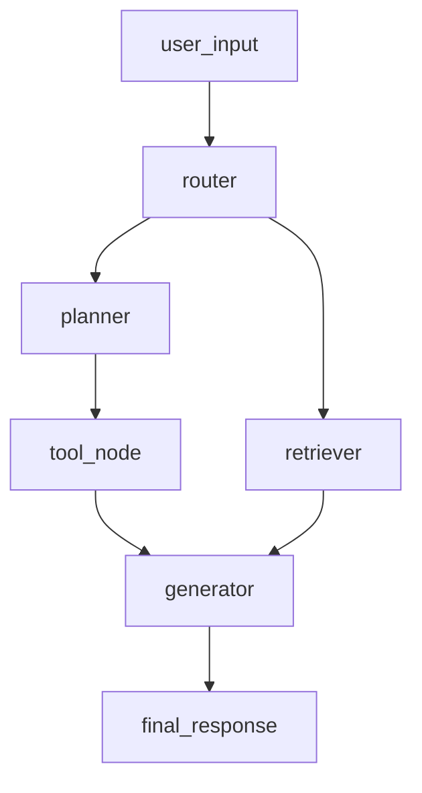

# multibranch

> Branching router agent: a tool path and a retrieval path that rejoin.

| field | value |
| --- | --- |
| version | 0.2 |

## Graph



## Weather in Berlin

### user_input · 21:39:58

**Input**: `What's the weather in Berlin?`

### router · 21:39:58

**llm_input**: `Pick a route for the request...`

**llm_output**: `{"route": "planner", "confidence": 0.92}`

### planner · 21:39:58

**llm_input**: `Decompose into tool calls...`

**llm_output**: `{"plan": ["weather_api(city='Berlin')"]}`

### tool_node · 21:39:58

### generator · 21:39:58

**llm_input**: `Answer using the tool result...`

**llm_output**: `It's 19C and partly cloudy in Berlin.`

### final_response · 21:39:58

**Output**: `It's 19C and partly cloudy in Berlin.`

## Summarize research paper

### user_input · 21:39:58

**Input**: `Summarize the attached research paper.`

### router · 21:39:58

**llm_input**: `Pick a route for the request...`

**llm_output**: `{"route": "retriever", "confidence": 0.88}`

### retriever · 21:39:58

**Input**

```json
{
  "topK": 4,
  "namespace": "papers"
}
```

**Retrieved docs**

```json
[
  {
    "id": "doc-7",
    "score": 0.81
  },
  {
    "id": "doc-2",
    "score": 0.77
  }
]
```

### generator · 21:39:58

**llm_input**: `Summarize the retrieved documents...`

**llm_output**: `The paper proposes a sparse attention variant with near-linear cost.`

### final_response · 21:39:58

**Output**: `The paper proposes a sparse attention variant with near-linear cost.`
