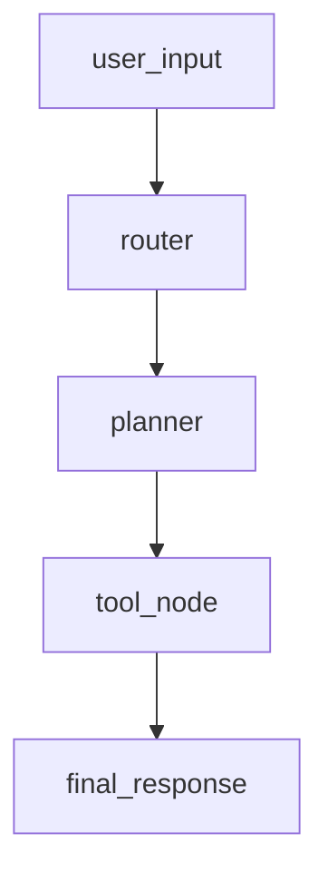

# quickstart

> Tiny router agent recorded with the WizardFlow Python SDK.

| field | value |
| --- | --- |
| version | 0.2 |

## Graph

- **router** — Classifies the request and picks the next node.
- **planner** — Decomposes the request into concrete tool calls.
- **tool_node** — Runs the planned tool calls against external APIs.

## msg-1

### user_input · 13:13:58

**Input**: `What's the weather in Berlin?`

### router · 13:13:58

**llm_input**: `Route this request...`

**llm_output**: `{"route": "planner"}`

### tool_node · 13:13:58

### final_response · 13:13:58

**Output**: `It's 19C and partly cloudy in Berlin.`

## Summarize the paper

**outcome**: answered · **latency_ms**: 320

### user_input · 13:13:58

**Input**: `Summarize the paper.`

### router · 13:13:58

**llm_output**: `{"route": "planner"}`
